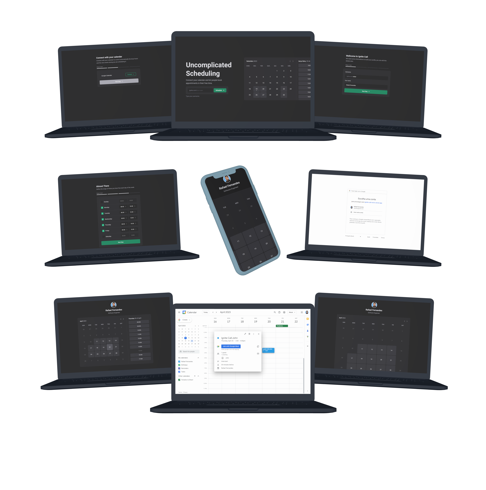

<p align="center">
  <a href="https://ignite-call-orcin.vercel.app/">
 </a>
</p>

<h3 align="center">Ignite Call</h3>

<p align="center">


</p>

---



---

<p align="center"> This app was created on Rocketseat course and was build to improve the NextJS concept, OAuth, server side rendering, static paths and more. It's a serverless RESTFull APP and have MYSQL db managed on PlanetScale service. Language: Typescript, some libs: Axios, Styled Components, Radix-UI, React hook form, Next Auth and more.
</p>

## 📝 Table of Contents

- [About](#about)
- [Getting Started](#getting_started)
- [Usage](#usage)
- [Built Using](#built_using)
- [Authors](#authors)

## 🧐 About <a name = "about"></a>

The Ignite Call allows users to easily schedule meetings on Google Calendar with other individuals who have created an account on the app. Users can set their weekly availability and share their calendar link with the desired person.

Key Features:

Schedule Meetings: Users can create and schedule meetings with someone else using the Meeting Scheduler App.

Google Calendar Integration: The app integrates with Google Calendar, enabling users to seamlessly schedule meetings on their existing calendar.

Account Creation: Users can create an account on the app to access its features and schedule meetings with other users.

Set Weekly Availability: Users can set their availability for the week, specifying their preferred time slots for meetings.

Calendar Link Sharing: Users can easily share their calendar link with others, allowing them to view available time slots and schedule meetings accordingly.

This Meeting Scheduler App simplifies the process of scheduling meetings on Google Calendar by providing a user-friendly interface, allowing users to set their availability, and facilitating calendar link sharing with other app users.

## 🏁 Getting Started <a name = "getting_started"></a>

You can clone the project and start on your local host or open the site hospeded <a href="https://ignite-call-orcin.vercel.app/">here</a>

Clone

```
git clone https://github.com/raferdev/ignite_call
```

Install Dependencies

```
npm i
```

Start Server

```
npm run dev
```

The browser will remote open on the local link on port 3000. Exemple .:

```
http://localhost:3000
```

## 🎈 Usage <a name="usage"></a>

- Make an user account, just choice your nick name.
- Put your full name.
- Connect with your google calendar.
- Select the days and hours of your week avaiability.
- Now you have a calendar that you can send to others.
- Just select the day on it, the hour and finish by add your relevant personal info to the meeting.

## ⛏️ Built Using <a name = "built_using"></a>

- [HTML](https://developer.mozilla.org/pt-BR/docs/Web/HTML) - Markup Language

- [Stitches](https://stitches.dev/) - CSS-in-JS

- [Typescript](https://developer.mozilla.org/pt-BR/docs/Web/typescript) - Javascript with super powers language

- [ReactJS](https://pt-br.reactjs.org/) - Javascript Superset Library

- [NextJS](https://nextjs.org/) - React Framework

- [Prisma](https://www.prisma.io/) - Next-generation Node.js and TypeScript ORM

- [MYSQL](https://www.mysql.com/) - MySQL Cluster enables users to meet the database challenges of next generation

## ✍️ Authors <a name = "authors"></a>

- [@raferdev](https://github.com/raferdev) - build
- [@rocketseat](https://github.com/rocketseat) - idea
